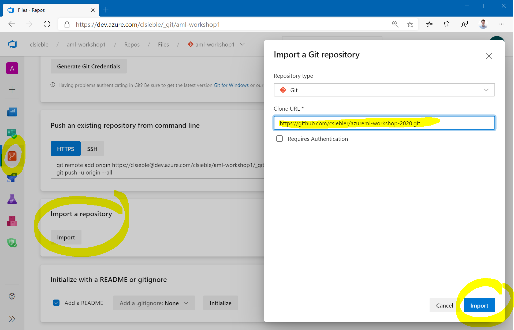
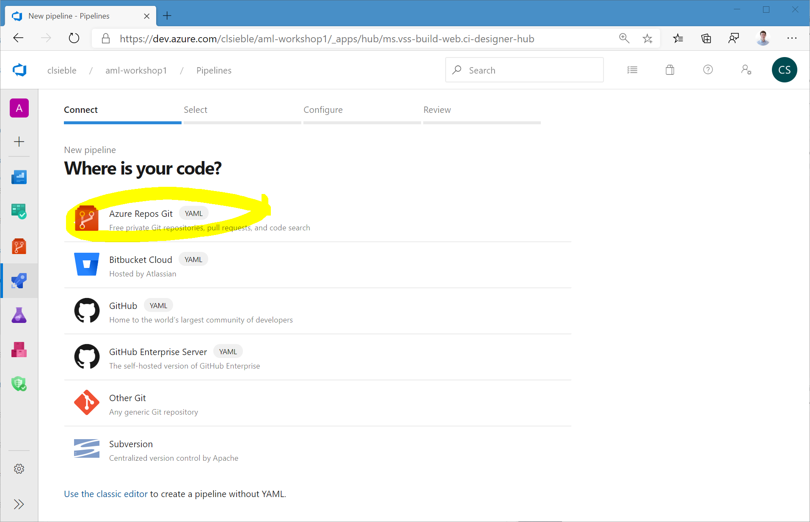
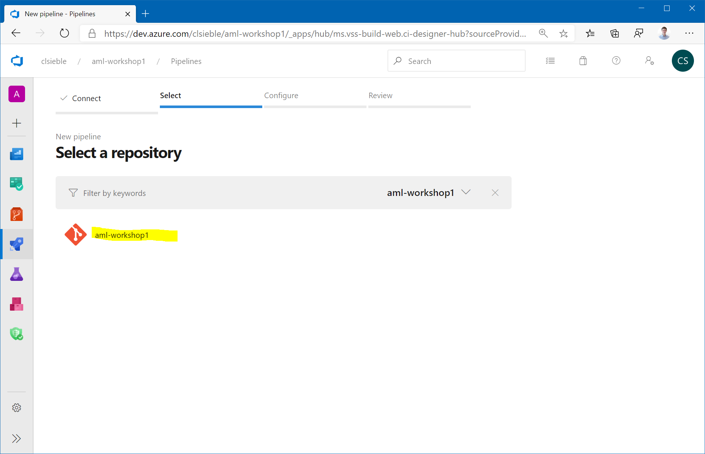
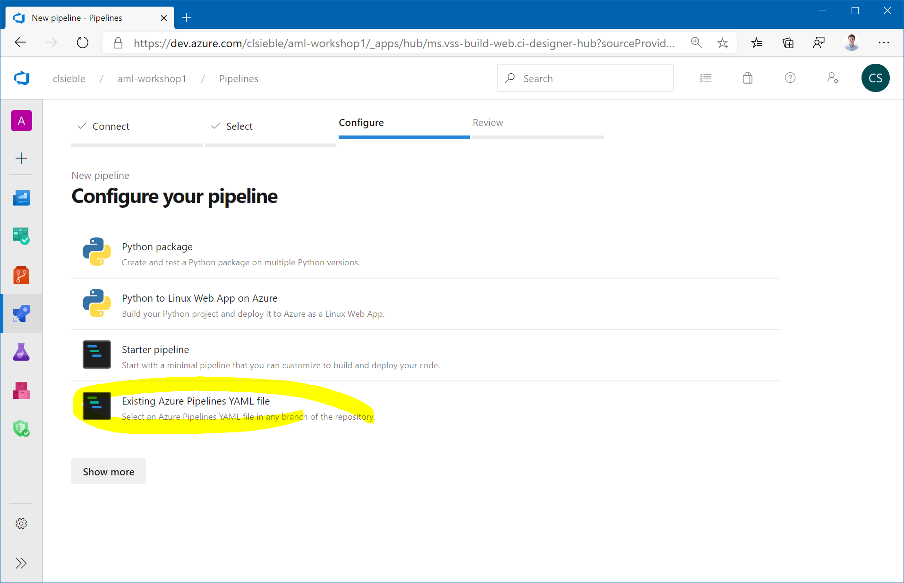
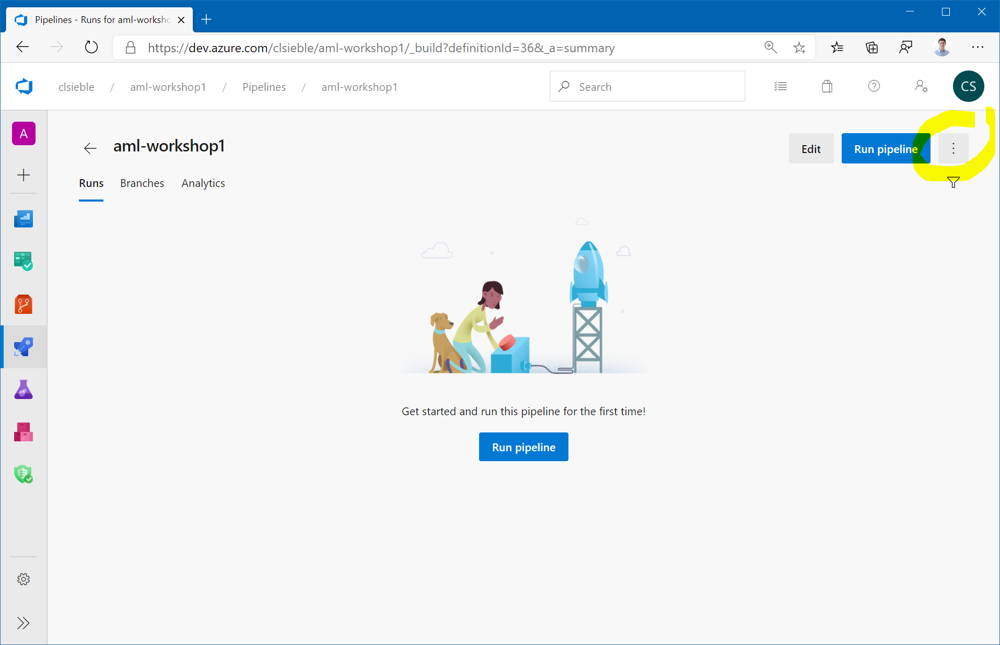
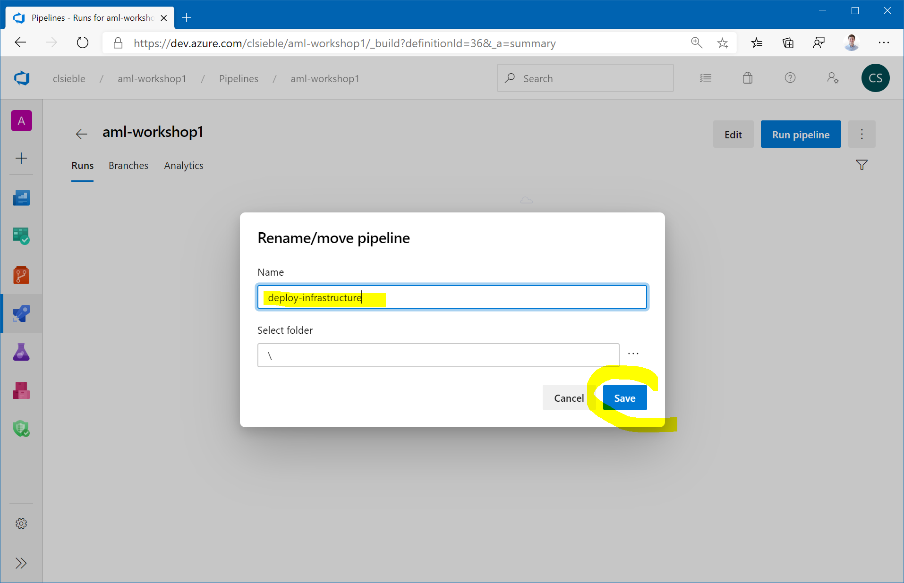
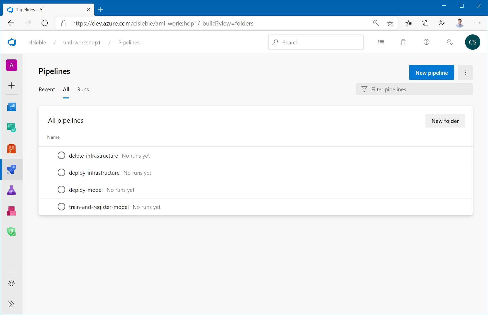

# Import the workshop repo to Azure DevOps

Go to your Azure DevOps project, into the Repos area.
Click on the Git repo dropdown at the top of the page and then on "Import Repository".

Under clone URL, you can put https://github.com/csiebler/azureml-workshop-2020.git

Next, let's connect your ML workspace to Azure DevOps.

# Connect your ML workspace to a DevOps project

This workshop leverages the **Azure Machine Learning** extension that should be installed in your organization from the [marketplace](https://marketplace.visualstudio.com/items?itemName=ms-air-aiagility.vss-services-azureml).

In order to set up automated training and deployment, you need to create a service connection to your ML workspace. To get there, go to your Azure DevOps project settings page (by clicking on the gear wheel to the bottom left of the screen), and then click on **Service connections** under the **Pipelines** section. The Azure ML extension uses an **Azure Resource Manager** service connection.

**Important:** Make sure you point it to workshop workspace and be sure to name the Service connection `aml-workshop`!

**Note:** Creating service connection using Azure Machine Learning extension requires 'Owner' or 'User Access Administrator' permissions on the Workspace.

This is how your service connection looks like. Make sure to pick your resource group and AML workspace.

The first phase of bringing your ML workflow to production is being able
to reproduce and automate the model training process.

In this repo, you will find four pipelines:

- [`pipelines/deploy-infrastructure.yml`](pipelines/deploy-infrastructure.yml) - Provisions a compute cluster for performing model training, as well as the AKS cluster for model deployment
- [`pipelines/train-and-register-model.yml`](pipelines/train-and-register-model.yml) - Trains the model on the compute cluster and registers it
- [`pipelines/deploy-model.yml`](pipelines/deploy-model.yml) - Deploys the model to the AKS cluster
- [`pipelines/delete-infrastructure.yml`](pipelines/delete-infrastructure.yml) - Deletes the AKS cluster and also the compute cluster (just used here for testing here, so that you can delete your AKS cluster quickly)

The pipelines derive their configuration variables from:

- [`pipelines/config.yml`](pipelines/config.yml) - Contains all names and configuration paramters for the pipelines

# Create pipelines

Goto Pipelines (Rocket symbol), select `Create Pipeline` and pick `Azure Repos Git`:

Select your repo:

Select `Existing Azure Pipelines YAML file`:

Select the pipeline
`/3-mlops/pipelines/deploy-infrastructure.yml` from the list:

Instead of hitting `Run`, hit the down arrow and select `Save`:

Then select the three dots and select `Rename`:

Rename the pipeline to `deploy-infrastructure` and hit `Save`:

Repeat the steps above three times and import the following pipelines:

- `/3-mlops/pipelines/train-and-register-model.yml` and rename to `train-and-register-model`
- `/3-mlops/pipelines/deploy-model.yml` and rename to `deploy-model`
- `/3-mlops/pipelines/delete-infrastructure.yml` and rename to `delete-infrastructure`

Once done, your pipelines should look like this (select `All` tab): 

# Run pipelines

For sake of this workshop, we have disabled automatic triggering of the pipelines. Hence, we can now manually run three out of the four pipelines manually:

1. `deploy-infrastructure`
1. `train-and-register-model`
1. `deploy-model`

The last pipeline `delete-infrastructure` can be used to get rid of the AKS cluster (for saving cost).

Once all three pipelines ran, we should be able to see in the AzureML studio:

- New experiment run should have been created
- Model should have been registered
- A new endpoint should have been registerd 

New experiment:

Model registered:

We can now try out the model by using the `Consume` tab under the AKS endpoint.

Done!